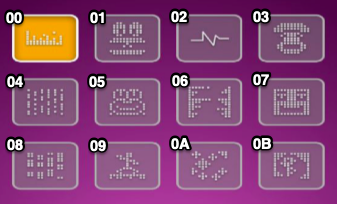

# Divoom Timebox Evo <!-- omit in toc -->
This protocol documentation is for the Divoom Timebox Evo only.
All the code examples are going to be in `javascript`.

This is inspired by:
* https://github.com/MarcG046/timebox
* https://github.com/derHeinz/divoom-adapter
* https://github.com/mumpitzstuff/fhem-Divoom
* https://github.com/MarcG046/timebox/blob/master/doc/protocol.md

# TOC <!-- omit in toc -->

- [Least Significant Byte first (LSB First)](#least-significant-byte-first-lsb-first)
- [Sending Messages](#sending-messages)
  - [Setting parameters of the Timebox](#setting-parameters-of-the-timebox)
    - [Set Temperature and Weather](#set-temperature-and-weather)
    - [Set Brightness](#set-brightness)
  - [Commands](#commands)
    - [Requesting Settings](#requesting-settings)
  - [Channels](#channels)
    - [Switching to a channel](#switching-to-a-channel)
    - [Specific channel options](#specific-channel-options)
      - [Time](#time)
      - [Lightning](#lightning)
      - [Cloud Channel](#cloud-channel)
      - [VJ Effects](#vj-effects)
      - [Visualization](#visualization)
      - [Animation](#animation)
      - [Scoreboard](#scoreboard)
  - [Animations, Images and Text](#animations-images-and-text)
    - [Calculate the image data](#calculate-the-image-data)
      - [Color String (`COLOR_DATA`)](#color-string-colordata)
      - [Pixel String (`PIXEL_DATA`)](#pixel-string-pixeldata)
    - [Animations](#animations)
      - [Message Header](#message-header)
      - [Frame format (`FRAME_DATA`)](#frame-format-framedata)
      - [Composing the resulting message](#composing-the-resulting-message)
    - [Images](#images)
- [Receiving messages](#receiving-messages)
  - [command 46 (WIP)](#command-46-wip)
  - [command 44 & 45](#command-44--45)
  - [command 31 & 32](#command-31--32)

# Documentation <!-- omit in toc -->
## Least Significant Byte first (LSB First)
Numbers (especially lengths) are coded in LSB first
To find the resulting number:
* `byte1 = value & 0xFF`
* `byte2 = (value >> 8) & 0xFF`
* `Result = (byte1.toHexString() + byte2.toHexString())`

`toHexString()` would be a function to convert a decimal number (`from 0 to 255`) to its hexadecimal string equivalent.

That would be the function in `js`
```js
function int2hexlittle(value) {
    const byte1 = (value & 0xFF).toString(16).padStart(2, "0");
    const byte2 = ((value >> 8) & 0xFF).toString(16).padStart(2, "0");
    return `${byte1}${byte2}`;
}
```

## Sending Messages

`01 LLLL PAYLOAD CRCR 02`

* All the messages will start with `01` and end with `02`
* `LLLL` is the length of the `PAYLOAD` string + the length of the CRC (`4`) in number of bytes (`FF` is one byte for example) in LSB First
  ```js
  function getLength (payload) {
    // CRC is 4 characters
    // We divide by 2 because 1 byte is 2 Hex char
    const lenght = (payload.length + 4) / 2;
    return int2hexlittle(length);
  }
  ```
* `CRCR` is the CRC of the message including the length (`LLLL PAYLOAD`) in LSB First
  ```js
  function getCRC(str) {
    let sum = 0;
    for (i = 0, l = str.length; i < l; i += 2) {
      sum += parseInt(str.substr(i, 2), 16)
    }
    return int2hexlittle(sum);
  }
  ```
  * `PAYLOAD` is anything based on the documentation below

Split the message every `1332` characters and send that as a binary buffer to

-----

### Setting parameters of the Timebox

#### Set Temperature and Weather

Full String: `5F TT WW`

`5F`: Fixed String<br />
`TT`: Temperature encoded on 1 byte<br />
* If temperature is `0 >= Temp > 128`: `TT` is the value of the temperature in Hexadecimal
* If temperature is `-128 < Temp < 0`: `TT` is 256 - temperature value in Hexadecimal
  ```js
  if (temp >= 0) {
      encodedTemp = temp.toString(16).padStart(2, "0");
  } else {
      let value = 256 + temp
      encodedTemp = value.toString(16).padStart(2, "0");
  }
  ```
`WW`: Weather encoded on 1 byte:
* `01`: Clear Weather
* `03`: Cloudy Sky
* `05`: Thunderstorm
* `06`: Rain
* `08`: Snow
* `09`: Fog

#### Set Brightness

Full String: `74 BB`

`74`: Fixed String<br />
`BB`: Brightness in Hex (0 - 100 values only)<br />
```js
function map(x, in_min, in_max, out_min, out_max) {
  return (x - in_min) * (out_max - out_min) / (in_max - in_min) + out_min;
}
function getBrightness(brightness, min_bri, max_bri) {
  return Math.ceil(map(brightness, min_bri, max_bri, 0, 100)).toString(16).padStart(2, "0")
}
```

----

### Commands

#### Requesting Settings

Full String: `46`<br />
The box will answer with a message. See [here](#command-46) for how to interpret the answer.

----

### Channels

#### Switching to a channel

`45`: Fixed to say we're switching to a channel<br />
`XX`: Channel number, followed by...

* `00`: [Time](#time)
* `01`: [Lightning](#lightning)
* `02`: [Cloud Channel](#cloud-channel)
* `03`: [VJ Effects](#vj-effects)
* `04`: [Visualization](#visualization)
* `05`: [Animation](#animation)
* `06`: [Scoreboard](#scoreboard)

There are optional parameters for each channel. If unspecified, it will just switch the channel.

#### Specific channel options

##### Time

Full String: `450001 TT XX WW EE CC RRGGBB`

`450001`: Fixed AFAIK<br />
`TT`: Type of clock
* `00`: Full screen
* `01`: Rainbow
* `02`: With Box
* `03`: Analog Square
* `04`: Full Screen negative
* `05`: Analog Round

`XX`: Show Time: `00` to not display it, `01` to show it<br />
`WW`: Show Weather: `00` to not display it, `01` to show it<br />
`EE`: Show Temperature: `00` to not display it, `01` to show it<br />
`CC`: Show Calendar: `00` to not display it, `01` to show it<br />
`RRGGBB`: Color of the clock in Hex<br />

##### Lightning

Full String: `4501 RRGGBB BB TT PP 000000`

`4501`: Fixed String<br />
`RRGGBB`: Color encoded in Hexadecimal<br />
`BB`: Brightness (0 - 100) in Hexadecimal<br />
`TT`: Type of Lightning<br />
* `00`: Plain color
* `01`: Love
* `02`: Plants
* `03`: No Mosquito
* `04`: Sleeping

`PP`: Power should usually be `01` (`00` would turn off the display)<br />
`000000`: Fixed String

##### Cloud Channel

Full String: `4502`<br />
There is no option for this one.

##### VJ Effects

Full String: `4503 TT`

`4503`: Fixed String<br />
`TT`: Type of VJ Effect from the image below<br />


##### Visualization

Full String: `4504 TT`

`4504`: Fixed String<br />
`TT`: Type of Visualization from the image below<br />


##### Animation

Upload animations not yet reversed engineered

##### Scoreboard

Full String: `450600 RRRR BBBB`

`450600`: Fixed AFAIK<br />
`RRRR`: Score for Red player<br />
`BBBB`: Score fore Blue player<br />

The score format is from 0 to 999 encoded in Hexadecimal LSB First.
```js
function getScoreBoardEncoded(red, blue) {
  return int2hexlittle(Math.min(999, red))+int2hexlittle(Math.min(999, blue))
}
```

### Animations, Images and Text

#### Calculate the image data

An image data is composed of a palette and a representation of the pixel composing the image.
Each pixel references a color from the color palette. You can't have more than 256 colors in a palette, but you only have 256 pixels on the screen so that's okay.

Algorithm:
* You'll need 2 arrays: `pixelArray` and `colorArray`
* `x` and `y` are the coordinates of the current pixel on the source image
* Parse your image left to right, top to bottom (preferably)
* If the pixel color in the image doesn't exist in the `colorArray`:
  * push that color to the `colorArray`
  * retrieve the index where of that new element you just pushed in the `colorArray`
  * store this index into `pixelArray[x + 16 * y]`
* If the pixel color already exists in the `colorArray`:
  * retrieve the index where the color is stored in the `colorArray`
  * store this index into `pixelArray[x + 16 * y]`

Once the image is completely parsed, you can build your color string and your pixel string.

##### Color String (`COLOR_DATA`)
The color string is pretty straightforward to build:
* Iterate over `colorArray`
* For each color, append the value in hexadecimal `RRGGBB` to the resulting `colorString`

```js
function _getColorString(colorArray: number[]): string {
  var colorString = '';
  colorArray.forEach((color) => {
    colorString += color.toString(16).padStart(6, '0')
  })
  return colorString;
}
```

You're done!

##### Pixel String (`PIXEL_DATA`)
The pixel string is a bit more complex:
* You first need to calculate the number of bits needed for each pixel:
  * `nbBits = log(colorArray.length) / log(2)`
  * If the `nbBits` is a float, truncate the value and add 1 to it.
  * If the `nbBits` is 0, add 1
* Then for each entry in `pixelArray`:
  * convert the value to a binary representation (8 bits)
  * reverse it (`b1 b2 b3 b4 b5 b6 b7 b8` becomes `b8 b7 b6 b5 b4 b3 b2 b1`)
  * keep only the first `nbBits` from this result
  * append each bit of that result to a `bitArray`
* The resulting `bitArray` should have a length which is a multiple of 8.
* Then loop over `bitArray` 8 entries by 8 entries:
  * Take the 8 entries (which is then a byte)
  * reverse them again (`b1 b2 b3 b4 b5 b6 b7 b8` becomes `b8 b7 b6 b5 b4 b3 b2 b1`)
  * Convert that result to an hexadecimal string representation of 1 byte (`XX`, 2 characters), do not forget leading 0s
  * Append that to the final `pixelString`

```js
function _getPixelString(pixelArray: number[], nbColors: number): string {
  let nbBitsForAPixel = Math.log(nbColors) / Math.log(2);
  let bits = Number.isInteger(nbBitsForAPixel)
    ? nbBitsForAPixel
    : (Math.trunc(nbBitsForAPixel) + 1);
  if (bits === 0) bits = 1;

  let pixelString = '';
  pixelArray.forEach((pixel) => {
    pixelString += pixel.toString(2).padStart(8, '0').split("").reverse().join("").substring(0, bits)
  })

  let pixBinArray = pixelString.match(/.{1,8}/g);
  let pixelStringFinal = '';
  pixBinArray!.forEach((pixel) => {
    pixelStringFinal += parseInt(pixel.split("").reverse().join(""), 2).toString(16).padStart(2, '0');
  })

  return pixelStringFinal;
}
```

You're done!

#### Animations

I didn't yet find a way to send all the 9 animations like like you would do with the app. However this section covers a way to send an endless looping animation that will be displayed on screen.

Each message's payload needs to be `400` excluding header, size, CRC and trailer
```
01 LLLL 49 XXXX XX PAYLOAD CCCC 02
```
The payload is all the frames concatenated in one string and then split every 400 characters

##### Message Header

`49 LLLL NN FRAME_DATA`<br />
`49`: Fixed to say we're sending an animation<br />
`LLLL`: Sum of all sizes of all frames (after `AA`) in LSB First<br />
`NN`: Packet Number, starting at 0 (each packet has a data payload of 400 top)<br />
`FRAME_DATA`: See below

##### Frame format (`FRAME_DATA`)

For each frame of your animation, you'll have to build a frame string.

A frame is always of the same format: `AA LLLL TTTT RR NN COLOR_DATA PIXEL_DATA`
`AA`: Frame Start<br />
`LLLL`: Full `FRAME_DATA` **string** length divided by 2 (or number of bytes representing `FRAME_DATA`) in LSB First<br />
`TTTT`: Time of the frame in ms in LSB First<br />
`RR`: Reset Palette `00` else `01` (Reset palette if number of colors since beginning > 256?) I decided to reset the palette on each frame, I didn't manage to make it work otherwise<br />
`NN`: Number of Colors in the frame's palette in hexadecimal, if 256, put `00` <br />
`COLOR_DATA`: See [COLOR_DATA](#color-string-colordata)<br />
`PIXEL_DATA`: See [PIXEL_DATA](#pixel-string-pixeldata)<br />

##### Composing the resulting message

1. Build a string of all your `FRAME_DATA` concatenated
2. Split the string every 400 characters
3. Prepend the message header (`49 LLLL NN`) to it, this is now your `PAYLOAD`
4. Send this message (with the usual `01 LLLL PAYLOAD CRCR 02`)

#### Images

An image is always the same format:
```
44000A0A04 AA LLLL 000000 NN COLOR_DATA PIXEL_DATA
           |<---------- IMAGE_DATA ------------->|
```
`44000A0A04`: Fixed header<br />
`AA`: Image Start<br />
`LLLL`: Full `IMAGE_DATA` **string** length divided by 2 (or number of bytes representing `IMAGE_DATA`) in LSB First<br />
`000000`: Fixed String<br />
`NN`: Number of colors in the image's palette in hexadecimal, if 256, put `00` <br />
`COLOR_DATA`: See [COLOR_DATA](#color-string-colordata)<br />
`PIXEL_DATA`: See [PIXEL_DATA](#pixel-string-pixeldata)<br />

----

## Receiving messages

The answer is always in this format:
`01 LLLL 04 CC 55 PAYLOAD CRCR 02`

`01`: Start of the message<br />
`LLLL`: the length of the command which is between the first `01` and the last `02` in LSB First<br />
`PAYLOAD`: The content of the message<br />
`CRCR`: The CRC of the message<br />
`02`: Fixed

The `PAYLOAD` will usually be of this format:<br />
`04`: Fixed AFAIK<br />
`CC`: Command number<br />
`55`: Fixed AFAIK<br />
`CMDDATA`: The data associated to the command

```js
var hexlify = function(str) {
    var result = '';
    var padding = '00';
    for (var i=0, l=str.length; i<l; i++) {
      var digit = str.charCodeAt(i).toString(16);
      var padded = (padding+digit).slice(-2);
      result += padded;
    }
    return result;
  };

function divoomBufferToString(raw) {
  return hexlify(raw.toString('ascii'));
}

function parseDivoomMessage(msg) {
  let answer = {};
  answer.ascii = msg;
  answer.crc = msg.slice(-6, msg.length - 2);
  answer.payloadLength = msg.slice(2, 6);
  answer.command = msg.slice(8, 10);
  answer.fixed = msg.slice(10, 12);
  answer.cmddata = msg.slice(12, msg.length - 6);
  return answer;
}
```

### command 46 (WIP)

Example `PAYLOAD`: `044655 CC 00004a007f BB 7f010b BB 017f007f00010001000100`

`044655`: Fixed String<br />
`CC`: Channel currently displayed (See [here](#channels) for the code list)<br />
`BB`: Brightness in Hexadecimal (from `0` to `100` dec - `0x0` to `0x64` hex). It seems the value is at 2 positions<br />

### command 44 & 45

Example `PAYLOAD`:
* `044455 CC`
* `044555 CC`

`044455` or `044555`: Fixed String<br />
`CC`: Channel currently displayed (See [here](#channels) for the code list)<br />

### command 31 & 32
Example `PAYLOAD`:
* `043155 BB`
* `043255 BB`

`043155` or `043255`: Fixed String<br />
`BB`: Brightness in Hexadecimal (from `0` to `100` dec - `0x0` to `0x64` hex)<br />
